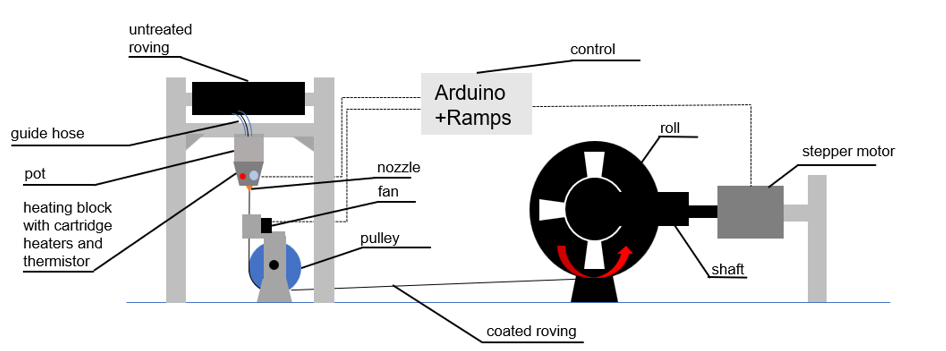
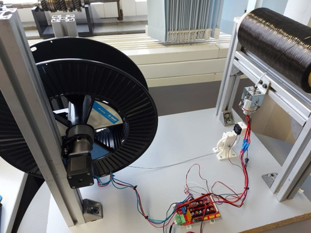
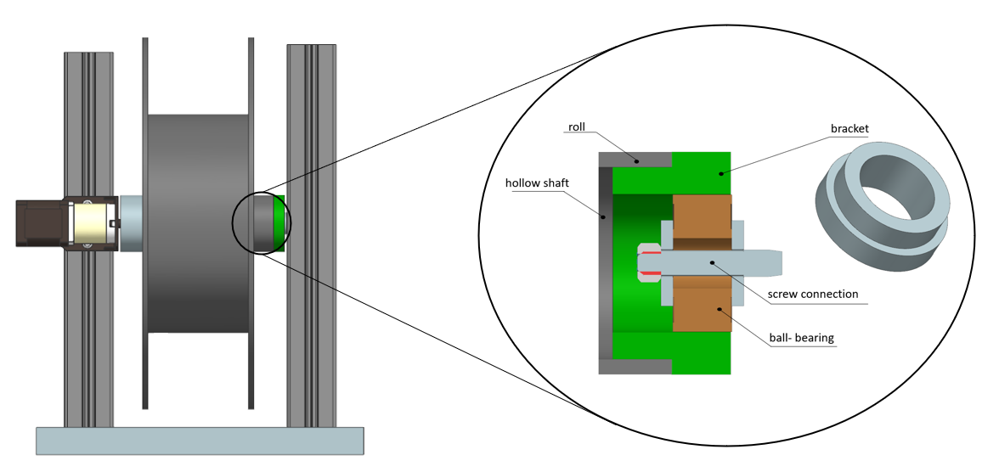
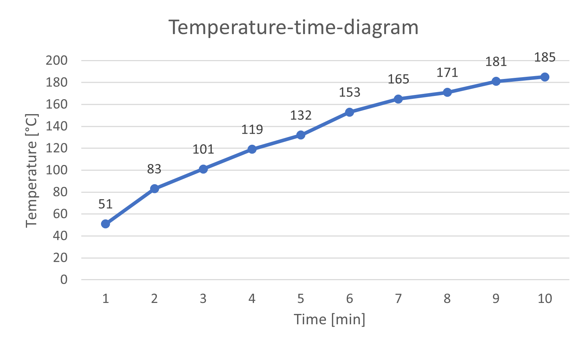
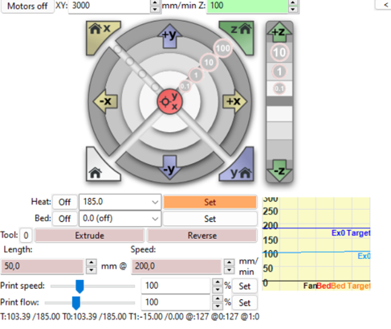
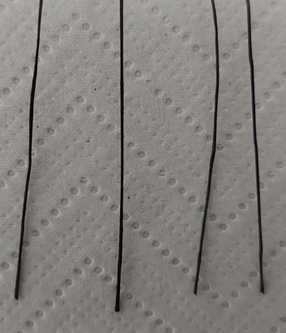

# 🤖 Automated Fiber Encapsulation for Fused Layer Modeling (FLM)

---

This repository contains the documentation, design files, and core firmware for an engineering project focused on the **automated encapsulation of continuous carbon fibers**. This system serves as a crucial **pre-processing step** for the production of high-strength composite components using Fused Layer Modeling (FLM) 3D printing.

## ✨ Project Goal & Context

---

The primary objective was to **design, implement, and validate** an automated machine capable of coating carbon fiber roving with a thermoplastic granulate. This process ensures the fibers are uniformly prepared for subsequent integration into a specialized FLM extruder, thereby enabling the production of mechanically superior, fiber-reinforced 3D prints.

## ⚙️ Core Concepts & Methodology

---

  
   <em>System concept diagram illustrating the automated fiber encapsulation process.</em>

The project followed a robust engineering design process:

* **1. Technical Foundations:** Comprehensive analysis of the FLM process and the **Markforged concept**—a key inspiration for embedding reinforced, encapsulated fibers to enhance component strength.

* **2. System Design & Requirements:**
    * **Requirements:** Critical system parameters were defined, including the necessity for reliable heating of the granulate (up to $185\ \text{°C}$), kink-free fiber deflection, and a consistent feed mechanism.
    * **Concept Selection:** A functional analysis led to the selection of a **stepper motor with planetary gear** for superior, precise fiber feeding control.

* **3. Implementation & Realization (Hardware/Software):**
    * **Hardware:** Custom 3D-printed parts were designed for the spool-to-motor connection. A stepper motor with a calculated torque of $M = 35\ \text{Ncm}$ was selected and integrated.
    * **Software/Control:** **Marlin firmware** was adapted and uploaded to an Arduino board to control the stepper motor, heating cartridges, thermistor, and cooling fan.

### 🔌 Component Realization & Connection

The physical system was realized by integrating the heating block, motor, and control electronics.

  
   <em>The complete, realized automated fiber encapsulation system.</em>

  
   <em>CAD view detailing the precise connection of the fiber spool/roll via a hollow shaft, bracket, screw connection, and ball bearing for smooth, kink-free feeding.</em>

---

## 💻 Software & Control Interface

The system is controlled via adapted Marlin firmware, allowing for precise regulation of temperature and feed rate.

### PID Temperature Control

The firmware successfully managed the heating block to melt the granulate, reaching the required temperature with minimal overshoot.

  
   <em>Graph showing the system’s temperature curve as the heating block reaches the required 185 °C melting temperature.</em>

### Pronterface User Interface

Direct control and testing of the system parameters were performed using the **Pronterface** user interface.

  
   <em>Screenshot of the Pronterface interface used for testing motor feed rates and managing heating commands.</em>

---

## ✅ Project Results & Validation

The project successfully delivered a validated system for fiber pre-processing.

  
   <em>Qualitative result: Magnified view of the produced carbon fibers, demonstrating uniform and consistent polymer encapsulation.</em>

**Key Findings:**
* **Process Validation:** The system reliably reached $185\ \text{°C}$ and effectively pulled the carbon fibers through the granulate melt pool.
* **Quality Output:** The final die successfully produced a **high-quality, evenly coated fiber**, suitable for reinforcing FLM-printed parts.
* **Thermal Stability:** A stable connection between the thermistor and the heating block proved crucial for accurate temperature readings and PID stability.

---

## 📁 Repository Contents

| File | Description |
|:------|:-------------|
| `Marlin.confi.ino/` | Adapted Marlin firmware for fiber encapsulation automation |
| `Configuration.h` | Main Marlin configuration (printer setup, steps, thermistors, dimensions) |
| `Configuration_adv.h` | Advanced Marlin settings (fiber feed tuning, stepper drivers, advanced features) |
| `Version.h` | Firmware version info and metadata |
| `concept.png` | System concept diagram for automated fiber encapsulation |
| `ippreal.jpg` | **Photo of the realized automated encapsulation system** |
| `connection.png` | **CAD drawing of the fiber roll connection mechanism** |
| `coatedfibres.png` | **Photo showing the result of the uniformly coated carbon fibers** |
| `pronterfacesurface.png` | **Screenshot of the Pronterface user interface** |
| `temperaturediagram.png` | **Graph of the heating block's temperature regulation** |

## 🚀 Next Steps

---

The successful production of high-quality encapsulated fibers paves the way for their subsequent use in a specialized **parallel dual-extruder** (the subject of the related bachelor's thesis) focused on creating stronger FLM-printed components.
